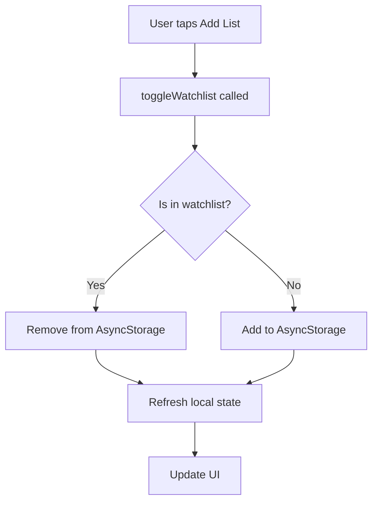

# Watchlist Feature Documentation

## 📱 Overview
The Watchlist feature allows users to save their favorite TV series for quick access later. Data is persisted locally using AsyncStorage, ensuring the watchlist survives app restarts.

## 🏗️ Architecture

### Files Created/Modified

#### 1. **Storage Layer** (`/services/storage/`)
- **`async-storage.ts`**: Generic AsyncStorage wrapper with type-safe methods
- **`watchlist.ts`**: Watchlist-specific service with CRUD operations
- **`index.ts`**: Barrel export for clean imports

#### 2. **Hooks** (`/hooks/`)
- **`use-storage.ts`**: Custom React hook for managing watchlist state and operations

#### 3. **Components** (`/components/tv/`)
- **`tv-details.tsx`**: Modified to include "Add to List" functionality

#### 4. **Screens** (`/app/(tabs)/`)
- **`watch_list.tsx`**: Complete watchlist display with grid layout

## 🔧 Implementation Details

### Storage Service (`watchlist.ts`)

```typescript
interface WatchlistItem {
  id: number;
  name: string;
  poster_path: string | null;
  vote_average: number;
  first_air_date: string;
  overview: string;
  backdrop_path: string | null;
  addedAt: number; // timestamp for sorting
}
```

**Key Methods:**
- `getWatchlist()`: Retrieves all saved items
- `addToWatchlist(series)`: Adds a series (prevents duplicates)
- `removeFromWatchlist(id)`: Removes a series by ID
- `isInWatchlist(id)`: Checks if series is saved
- `clearWatchlist()`: Removes all items

### Custom Hook (`useWatchlist`)

**Usage:**
```typescript
const { 
  watchlist,           // Array of watchlist items
  isInWatchlist,       // Boolean if current series is in list
  loading,             // Loading state
  addToWatchlist,      // Add function
  removeFromWatchlist, // Remove function
  toggleWatchlist,     // Toggle function
  refresh              // Manual refresh
} = useWatchlist(seriesId?);
```

**Features:**
- Auto-loads watchlist on mount
- Checks if specific series is in list (when `seriesId` provided)
- Automatic refresh after add/remove operations
- Error handling built-in

## 🎨 UI Components

### 1. TV Details - Add to List Button
Located in the "Quick Actions" section:
- Shows **"Add List"** with outline bookmark when not in watchlist
- Shows **"In List"** with filled yellow bookmark when added
- Tapping toggles the watchlist state

### 2. Watchlist Screen
Features:
- **Header**: Shows total count of saved series
- **Grid Layout**: 3 columns, responsive design
- **Remove Button**: Red close button on each card (top-right)
- **Empty State**: Friendly message when list is empty
- **Pull to Refresh**: Swipe down to reload
- **Auto-refresh**: Updates when screen comes into focus

## 📊 Data Flow



## 🚀 Usage Examples

### Adding to Watchlist (in any component)
```typescript
import { useWatchlist } from '@/hooks/use-storage';

function MyComponent({ series }) {
  const { toggleWatchlist, isInWatchlist } = useWatchlist(series.id);
  
  return (
    <Button onPress={() => toggleWatchlist(series)}>
      {isInWatchlist ? 'Remove' : 'Add'}
    </Button>
  );
}
```

### Displaying Watchlist
```typescript
import { useWatchlist } from '@/hooks/use-storage';

function WatchlistScreen() {
  const { watchlist, loading, removeFromWatchlist } = useWatchlist();
  
  if (loading) return <Loading />;
  
  return watchlist.map(item => (
    <Card 
      key={item.id} 
      data={item}
      onRemove={() => removeFromWatchlist(item.id)}
    />
  ));
}
```

## 🔐 Data Persistence

**Storage Key:** `@watchlist`

**Data Structure:**
```json
[
  {
    "id": 94605,
    "name": "Arcane",
    "poster_path": "/fqldf2t8ztc9aiwn3k6mlX3tvRT.jpg",
    "vote_average": 8.746,
    "first_air_date": "2021-11-06",
    "overview": "Amid the stark discord of twin cities...",
    "backdrop_path": "/rkB4LyZHo1NHXFEDHl9vSD9r1lI.jpg",
    "addedAt": 1698765432000
  }
]
```

## ✨ Features

### Current Implementation
✅ Add/Remove series from watchlist  
✅ Visual feedback (bookmark icon changes color)  
✅ Persistent storage (survives app restart)  
✅ Duplicate prevention  
✅ Grid layout display  
✅ Pull to refresh  
✅ Auto-refresh on screen focus  
✅ Empty state messaging  
✅ Loading states  

### Future Enhancements
🔮 Sort by: Date Added, Name, Rating  
🔮 Search within watchlist  
🔮 Categories/Tags  
🔮 Cloud sync (when user accounts added)  
🔮 Share watchlist  
🔮 Export/Import  

## 🐛 Error Handling

All storage operations include try-catch blocks:
- Failed reads return empty array `[]`
- Failed writes log to console
- UI gracefully handles missing data

## 🧪 Testing

To test the watchlist:

1. **Add items**: Open any TV series details, tap "Add List"
2. **Verify persistence**: Close app, reopen, check Watch List tab
3. **Remove items**: Tap X button on watchlist cards
4. **Empty state**: Remove all items to see empty message
5. **Refresh**: Pull down on watchlist to refresh

## 📦 Dependencies

- `@react-native-async-storage/async-storage`: v2.2.0 (already installed)
- `@expo/vector-icons`: For bookmark icons
- `expo-router`: For navigation and focus events

## 🎯 Best Practices Used

1. **Single Responsibility**: Each file has one clear purpose
2. **Type Safety**: Full TypeScript typing throughout
3. **Error Handling**: Graceful fallbacks for all operations
4. **Performance**: Minimal re-renders with proper memoization
5. **UX**: Loading states, empty states, visual feedback
6. **Code Reuse**: Generic storage wrapper allows future features

## 📝 Notes

- Watchlist is stored **locally per device**
- No user account required (anonymous usage)
- Maximum storage limited by AsyncStorage (~6MB on most devices)
- Consider pagination if watchlist exceeds 100+ items
